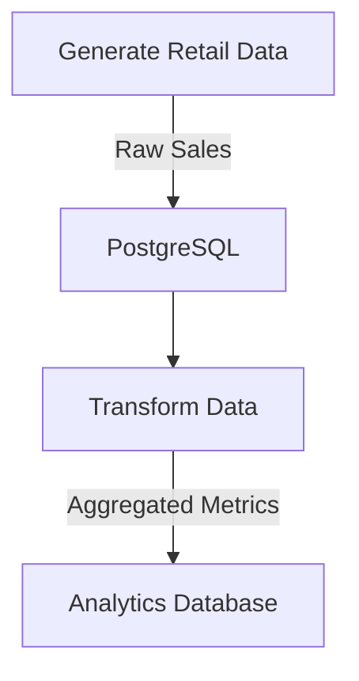

# ETL POC

---

# Retail Data Pipeline with Apache Airflow  
**Automated ETL pipeline for retail data generation, transformation, and analysis.**  

---

## **Project Overview**  
This project automates the generation and transformation of retail sales data using Apache Airflow. It includes:  
- **Data Generation**: Simulates retail transactions (sales, customers, products).  
- **Data Transformation**: Cleans, aggregates, and prepares data for analytics.  
- **Workflow Orchestration**: Scheduled DAGs to manage ETL processes.  

---

## **Key Features**  
- **Celery Executor**: Parallel task execution with Redis and PostgreSQL.  
- **Modular DAGs**: Reusable workflows for data generation and transformation.  
- **Backfill Support**: Reprocess historical data with `--reset-dagruns`.  
- **Dockerized**: Isolated environment with Airflow, PostgreSQL, and Redis.  

---

## **Tech Stack**  
| **Component**       | **Technology**          |  
|----------------------|-------------------------|  
| Workflow Orchestration | Apache Airflow 2.10.5 |  
| Database             | PostgreSQL 13           |  
| Queueing System       | Redis 7.2              |  
| Containerization      | Docker Compose         |  

---

## **Quick Start**  
### **Prerequisites**  
- Docker & Docker Compose ([Install Guide](https://docs.docker.com/get-docker/))  
- Python 3.8+ (for local development)  

### **2. Configure Environment**  
Create a `.env` file:  
```bash  
# .env  
AIRFLOW_UID=50000  
AIRFLOW_PROJ_DIR=./dags  # Path to your DAGs directory  
```

### **3. Start Services**  
```bash  
docker compose up -d  
```

### **4. Access Airflow UI**  
Visit `http://localhost:8080` and log in with:  
- **Username**: `airflow`  
- **Password**: `airflow`  

---

## **Project Structure**  
```  
.  
├── dags/                     # Airflow DAGs  
│   ├── data_generation.py     # Simulates retail transactions  
│   └── data_transformation.py # Cleans & aggregates data  
├── config/                   # Airflow configuration overrides  
├── plugins/                  # Custom Airflow plugins  
├── logs/                     # Airflow task logs  
├── docker-compose.yml        # Docker Compose setup  
└── .env                      # Environment variables  
```

---

## **Running a Backfill**  
Reprocess data for a specific date range:  
```bash  
docker compose exec airflow-scheduler airflow dags backfill \  
  --start-date 2024-03-10 \  
  --end-date 2024-04-08 \  
  --reset-dagruns \  
  retail_data_generate_transform  
```

---

## **Data Pipeline Architecture**  



# How to Run:  

- Start Airflow with ``
- Start docker-compose with ``
- Create table sales in adminer
- load data into sales table
    - docker cp Online_Retail_cleaned.csv airflow-postgres-1:/tmp/
    - docker exec -it airflow-postgres-1 bash
    - psql -U airflow -d postgres
    - \COPY prod_sales FROM 'tmp/Online_Retail_cleaned.csv' WITH (FORMAT csv, HEADER true, DELIMITER ',');  
- create other dim tables in adminer
    - docker cp dim_country.csv airflow-postgres-1:/tmp/
    - docker cp dim_customer.csv airflow-postgres-1:/tmp/
    - docker exec -it airflow-postgres-1 bash
    - psql -U airflow -d postgres
    - \COPY dim_country FROM 'tmp/dim_country.csv' WITH (FORMAT csv, HEADER true, DELIMITER ',');
    - \COPY dim_customer FROM 'tmp/dim_customer.csv' WITH (FORMAT csv, HEADER true, DELIMITER ',');
