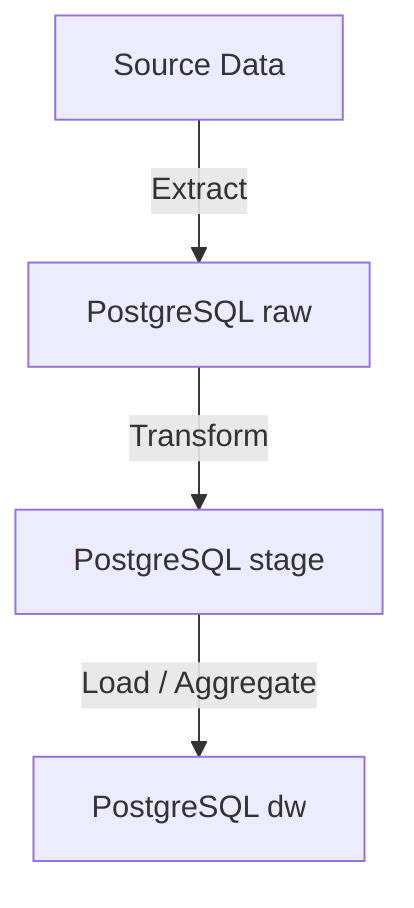

# ETL POC

---

# Retail Data Pipeline with Apache Airflow  
**Automated ETL pipeline for data extraction (generation), transformation, and analysis.**  

---

# **Project Overview**  
This project automates the ETL process using simulated retail sales data with Apache Airflow. It includes:  
- **Data Extration (generation)**: Simulates retail transactions (sales, customers, products).  
- **Data Transformation**: Cleans, aggregates, and prepares data for analytics.
- **Data Loading**: Loads data into datawarehouse system. 
- **Workflow Orchestration**: Scheduled DAGs to manage ETL processes.  



For more information about how to add a DAG, please refer [here](docs/adding_dags.md)

---

# **Key Features**  
- **Celery Executor**: Parallel task execution with Redis and PostgreSQL.  
- **Modular DAGs**: Reusable workflows for data generation and transformation.  
- **Backfill Support**: Reprocess historical data with `--reset-dagruns`.  
- **Dockerized**: Isolated environment with Airflow, PostgreSQL, and Redis.  

---

# **Tech Stack**  
| **Component**       | **Technology**          |  
|----------------------|-------------------------|  
| Workflow Orchestration | Apache Airflow 2.10.5 |  
| Database              | PostgreSQL 13           |  
| Queueing System       | Redis 7.2              |  
| Containerization      | Docker Compose         |  
| Data Processing      | Python and SQL         | 

---

# **Quick Start**  
## **Prerequisites**  
- Docker & Docker Compose ([Install Guide](https://docs.docker.com/get-docker/))  
- Python 3.8+ (for local development)  

## **2. Configure Environment**  
Create a `.env` file. You can use `.env_temp` as a reference for the needed environment variables:  

## **3. Start Services**  
```bash  
docker compose up airflow-init
docker compose up -d --build
```  

### 3.a. Docker compose will start the following services:  

| **Service**       | **Port**          |  
|-------------------|-------------------|  
| postgres          | 5432     |  
| adminer           | 8079     |  
| redis             | 6379     |  
| airflow-webserver | 8080     |  
| airflow-scheduler |          | 
| airflow-worker    |          | 
| airflow-triggerer |          | 
| airflow-cli       |          | 

### 3.b. Postgres will execute `sql/initialize_tables.sh`  

* Create schemas  
* Create tables in different schemas
* Create foreign keys

## **4. Manually set Postgress connection with Airflow**

Please execute the script below so Airflow DAGs know how to connect to PostgreSQL database.

```bash  
./airflow/local_scripts/initialize_airflow_postgres_connection.sh
```  

## **5. Manually Download data from url at `airflow/data/datasource.txt`**

And save it on that same folder.

## **6 Execute python script at airflow/local_scripts/create_online_retail_cleaned.py**  
  
It will minimally clean the dataset and save it at `airflow/data/Online_Retail_cleaned.csv`

## **7. Access Airflow UI**  
Visit `http://localhost:8080` and log in with:  
- **Username**: check `_AIRFLOW_WWW_USER_USERNAME` in .env
- **Password**: check `_AIRFLOW_WWW_USER_PASSWORD` in .env 

---

# **Sample ETL**  

For the POC purpose, a sample ETL process was created using data from a third-party place.  
  
* Sales data source: https://www.kaggle.com/datasets/tunguz/online-retail  

## Tables:  

* Refer to `sql/create_tables` folder for information about POC tables  

## Steps:  

* `local_scripts/create_online_retail_cleaned.py`: Clean original dataset to make it proper to be inserted in the raw schema (extraction phase).
* `dags/extract/sales.py`: 
  * DAG Name: `extract_sales`
  * Original goal: Extract data from production database and copy and paste to raw schema
  * POC goal: As we don't have production databases, we sample the data from the dataset and insert it into `raw/sales` database
* `dags/transform/transform_raw_sales.py`: Extra clean the data
  * DAG Name: `transform_sales`
  * Not business rules, just pure hard rules, such as removing test and robot users
  * Create sales `total_sale_usd` by using table fields `unitprice` and `quantity`, plus currency exchange information (set to 1 in the POC). 
  * Saved it in `stage.sales`
* `dags/load/load_dim_tables_from_sales.py`: Store dim and fact data that are created from sales data.
  * DAG Name: `load_dw_tables_from_sales`
  * Create `dw.dim_country` and `dw.dim_customer` from `stage.sales` data.
    * `dw.dim_customer` shows an example of how to deal with Slow Changing Dimensions type 2 (SCD2)
  * Create `dw.fact_sales`, containing cleaned and processed data from `stage.sales` data.
* `dags/load/load_sales_perform_daily.py`: Calculate different metrics and aggregations for sales performance that will next be used as input for dashboards.
  * DAG Name: `calculate_sales_performance`  

---

# **Project Structure**  
```  
.
├── airflow.cfn                          # Airflow configuration file
├── airflow.dockerfile                   # Custom Dockerfile for building the Airflow image
├── config/                              # Airflow configuration overrides and custom settings
├── dags/                                # Airflow DAGs (organized by ETL phase)
│   ├── extract/                         # DAG/tasks for extracting data from source systems
│   ├── load/                            # DAG/tasks for loading dimension tables
│   └── transform/                       # DAG/tasks for transforming raw sales data
├── data/                                # Sample data and notebooks
├── docker-compose.yaml                  # Docker Compose setup for Airflow and dependencies
├── local_scripts/                       # Utility scripts for local setup
│   └── initialize_airflow_postgres_connection.sh # Script to initialize Airflow Postgres connection
├── plugins/                             # Custom Airflow plugins
├── python/                              # Python modules for ETL logic
├── sql/                                 # SQL scripts for schema, table creation, and ETL
```

---